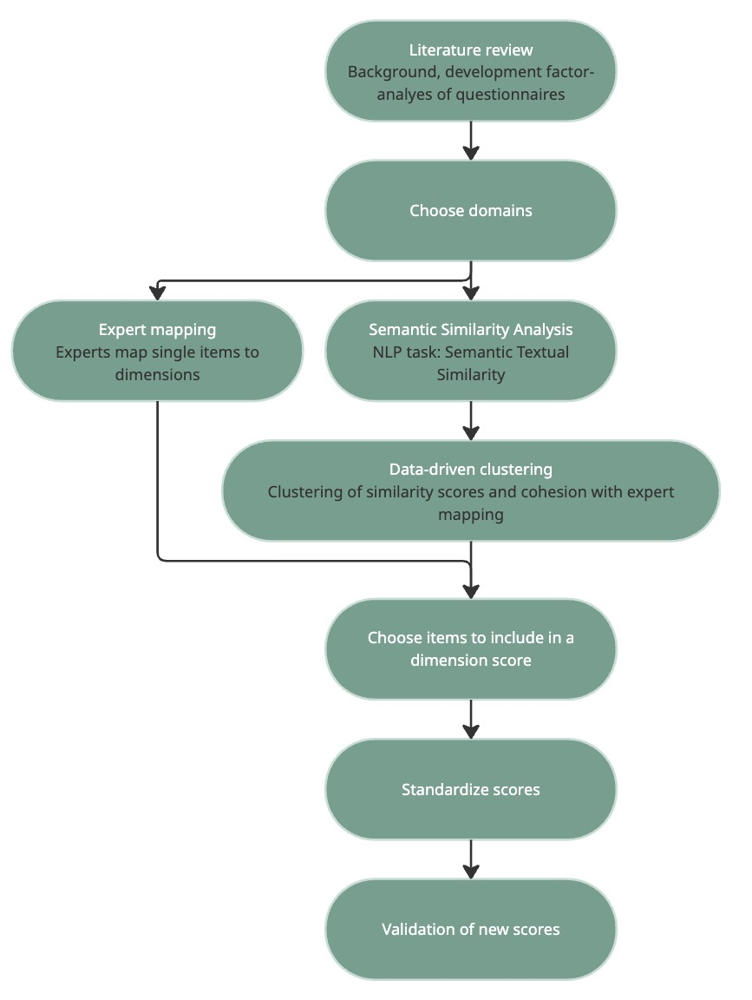

# Neuropsychiatry project

## Project team

- { width="120" }  
  **Eva van Heese**1 (brain morphology)  

- { width="120" }  
  **Julia Katharina-Pfarr**2 (questionnaire harmonisation)  

- { width="120" }  
  **Odile van den Heuvel**1, 3 (PI)  

- { width="120" }  
  **Ysbrand van der Werf**1 (PI)  

- { width="120" }  
  **Jean-Baptiste Poline**2 (PI)  

---

1*Amsterdam UMC location Vrije Universiteit Amsterdam, Department of Anatomy and Neurosciences, Amsterdam, the Netherlands*  
2*NeuroDataScience - ORIGAMI laboratory, McConnell Brain Imaging Centre, The Neuro (Montreal Neurological Institute-Hospital), Faculty of Medicine, McGill University, Montreal, Quebec, Canada*  
3*Amsterdam UMC location Vrije Universiteit Amsterdam, Department of Psychiatry, Amsterdam, the Netherlands*

## Neuropsychiatry in PD - brain morphology study

### Project summary

The aim of this project is to investigate brain morphology correlates of neuropsychiatric symptoms in Parkinson’s Disease. The project includes symptoms of depression, anxiety, apathy, hallucinations and psychosis, impulse control disorders, and sleep disturbances. 

Read more about this project in the full [secondary proposal PDF](https://drive.google.com/drive/folders/1g91YZIBgOT57smjhD9tDaBVSO73Jh8fD). 

Link to preregistration: *coming soon!*

## Neuropsychiatry in PD - questionnaire harmonisation study

### Project summary

Questionnaire data is often multidimensional and a mapping from one questionnaire to another, seemingly measuring the same construct, is not a straightforward process. Not only are there differences in the amount of questions or the scoring but sumscores of questionnaires differ in their underlying latent symptom profiles which introduces confounds for subsequent brain imaging analyses. Our harmonisation workflow is shown in this figure: 

<figure markdown="span">
  { width="500" }
  <figcaption>Harmonisation Workflow</figcaption>
</figure>

Read more about this study in the pre-registration (*coming soon!*)

[Link to GitHub repository](https://github.com/ENIGMA-infra/psych-in-harmony)

