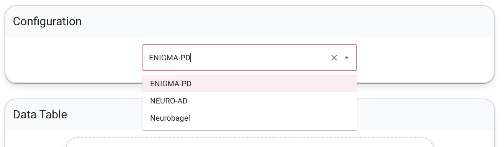
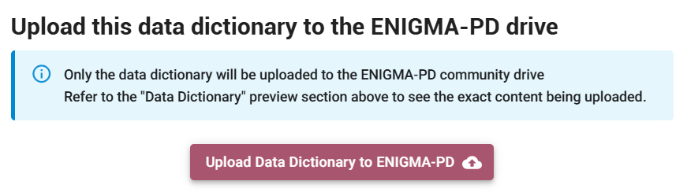
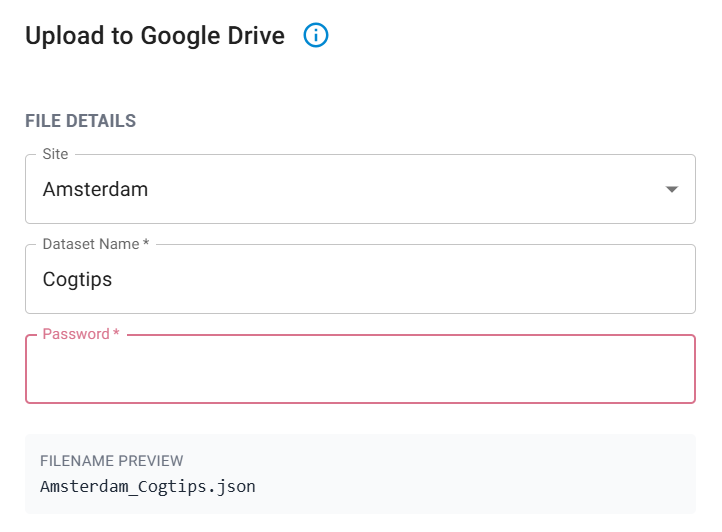

# ENIGMA‑PD Data Annotation Workflow  
*This page covers everything you need to get started with the Neurobagel Annotation Tool.*

## Why this matters
As ENIGMA‑PD moves toward sharing richer clinical, cognitive, and neuropsychiatric data across sites, we need a consistent and reliable way to interpret variables. Manual data dictionaries in spreadsheets are prone to typos, inconsistent naming, and misunderstandings about what each variable represents.  
The Neurobagel workflow provides a structured, user‑friendly way to standardize how we describe clinical data, making it easier to reuse datasets, combine them across sites, and support ENIGMA-PD projects with more advanced clinical measures.

In the future, we hope that the standardized annotations will make it easier for ENIGMA-PD to discover data availability across sites for ongoing and new projects.
You can see a pilot project for this at [enigma.neurobagel.org](https://enigma.neurobagel.org/).

---

## 1. ENIGMA‑PD Custom Variable List  
To support harmonized annotation, ENIGMA‑PD created a curated list of PD‑relevant variables. Standard vocabularies in Neurobagel are broad, and many PD‑specific assessments (cognition, motor, neuropsychiatry, behaviour) were missing. The ENIGMA‑PD list fills this gap and ensures that all sites annotate their data using the same shared terminology.

!!! info "ENIGMA-PD vocabulary"
    We are still expanding our ENIGMA-PD variable list. If you collect variables that other sites may also have, and that could be interesting for future ENIGMA-PD projects, please submit them to us through [this form](https://forms.gle/za9fEQCnhi5GZ4rt6). We would love to expand the list together.

### What this step provides
- A consortium‑wide reference list of PD‑specific assessments and clinical variables.  
- A controlled vocabulary that appears directly inside the Neurobagel Annotation Tool.  
- A mechanism for sites to suggest missing variables.

**Check out the ENIGMA‑PD variable list [here!](https://docs.google.com/spreadsheets/d/1pwi6df8LKc3xFENH9JcOUk1HKHARspt-2lUhsy2JYAE/edit?usp=sharing)**  

---

## 2. Annotation using Neurobagel
With the ENIGMA‑PD vocabulary integrated into the tool, sites can annotate their datasets in a structured and intuitive way.

!!! info "Privacy note"
      Although the annotation interface is a web app, it runs entirely on your computer and Neurobagel **does not upload any data or retain data**. Your data are used only to populate the annotation interface (read columns and possible values).

### What sites do in this step
- Go to [https://beta-annotate.neurobagel.org/](https://beta-annotate.neurobagel.org/)
- Select **ENIGMA-PD** as configuration.

- Upload a TSV file containing demographic and clinical variables. Please annotate **all clinical and demographic** variables available in your dataset.
- New to Neurobagel? Click through the introduction windows to get started.

#### Column annotation
**Goal:** Assign each column or group of columns to a standardized variable by clicking on them.

- Select multiple related columns at once using CTRL+click or SHIFT+click
- Can't find a column? Filter your column list by name using the search bar at the top left
- Can't find a variable? Use the search bar in the assessment tool list to narrow down options
- If no variable fits your column, please use the *description* field to provide us with more context to understand this column

#### Value annotation
**Goal:** Review all columns annotated in the previous step and describe their values.

- Mark missing values.  
- Optionally add short human‑readable descriptions for uncommon variables.  
- Done? Upload the data dictionary to a protected ENIGMA-PD google drive folder or download it locally and share it with the ENIGMA-PD team by email.

Click "Upload Data Dictionary to ENIGMA-PD"

Select your site from the drop-down menu, provide your cohort name, and type in the password (which was shared with you by email, if you've lost it, please reach out to us)

### Questions and support
For questions, please reach out to enigma-pd@amsterdamumc.nl and join [the Neurobagel discord server](https://discord.gg/sxnCT4QJ7a) for support.

### Why this helps
- Produces a consistent, machine‑readable data dictionary for each cohort.  
- Reduces human error compared to manual data dictionaries (if you make a mistake during annotation, you can simply load your data dictionary into the tool again and correct it)
- Makes datasets easier to understand, reuse, and combine.  

**Interested to learn more about Neurobagel?** Check out the Neurobagel documentation [here](https://neurobagel.org/user_guide/annotation_tool/)

---

## Feedback from early adopters  
- Annotation is straightforward and user‑friendly. It typically takes under an hour for a dataset of around 100 variables. And if you cannot finish in one go, you can always save your progress and continue later.   
- The main time investment is **the column annotation step**, selecting the correct variable from the ENIGMA‑PD vocabulary.  
- Overall experience: not difficult, but requires some attention to detail.

??? info "Add your feedback to improve the tool"
    The Neurobagel team continues to improve this tool together with us. If you have an idea for an improvement or find something difficult or confusing, please use the purple button "Give us feedback" on the right edge of the screen.

---

## Summary: next steps for sites  
- Annotate your clinical spreadsheet using the ENIGMA‑PD list and Neurobagel tool.  
- Reach out to enigma-pd@amsterdamumc.nl and join [the Neurobagel discord server](https://discord.gg/sxnCT4QJ7a) for support.
- Share feedback on missing variables (through [this form](https://forms.gle/za9fEQCnhi5GZ4rt6)) or usability improvements with the Neurobagel team, directly through the tool.
